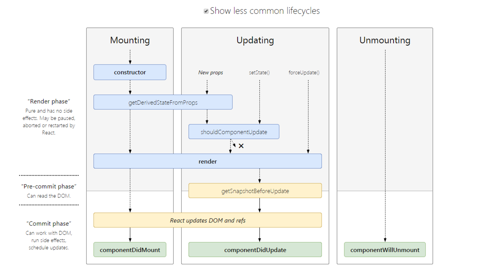

## React 

### 生命周期

自React 16.3开始，组件生命周期经过了比较大的改动。

对未来即将移除的三个生命周期添加 `UNSAFE_` 前缀：

- UNSAFE_componentWillMount()
- UNSAFE_componentWilReceiveProps()
- UNSAFE_componentWillUpdate()

并添加上新的生命周期：

- getDerivedStateFromProps()
- getSnapshotBeforeUpdate()




### 为什么要引入新的生命周期

为 React 的新 `Fiber` 算法做铺垫，**Fiber算法为了更高效的提升应用性能引入了异步渲染模式，这意味着在render函数之前的生命周期函数都可能会执行多次**。原先总会有开发者在生命周期函数中做一些副作用动作，例如在 `componentWillMount` 中进行 `ajax` 请求。

所以为了限制开发者在旧生命周期中调用 `this.setState()` 做一些将产生副作用的操作，因此引入了两个静态生命周期函数来替代旧生命周期函数。


### memo, PureComponent

如果组件是纯组件（同样的属性值传入会渲染出同样的结果），那么你对这个组件的期望当然是当下一次接受了相同的属性值时会去重用上一次的渲染结果，而不是再一次渲染。

但 React 默认不会执行这一操作,就像下述例子一样：

```jsx
import React from "react";
import "./styles.css";

function Title({ title }) {
  return <h1>{title}</h1>
}

export default function App() {
  const [count, setCount] = React.useState(0)
  return (
    <div className="App">
      <Title title="Hello Counter!"/>
      <p>{ count }</p>
      <button onClick={() => setCount(count+1)}>+1</button>
    </div>
  );
}
```

么次点击 `+1 button` 都会重新去渲染 `Title` 组件，这显然不是我们想要的结果。若要达到我们的目的，可以使用 `React.memo`。

```jsx
import React from "react";

function Title({ title }) {
  return <h1>{title}</h1>
}

const MemoTitle = React.memo(Title)

export default function App() {
  const [count, setCount] = React.useState(0)
  return (
    <div className="App">
      <MemoTitle title="Hello Counter!"/>
      <p>{ count }</p>
      <button onClick={() => setCount(count+1)}>+1</button>
    </div>
  );
}
```

现在，无论点击多少次按钮，都只会沿用上一次的渲染结果。

`PureComponent` 与 `React.memo` 都可以达到记忆化效果，区别在于 `PureComponent` 适用于类组件，而 `React.memo` 适用于函数组件。

### Portals

`Portrals` API通常用于将组件挂载到独立的DOM元素上，一个比较常见的例子就是模态框。

```jsx
import React from "react";

class Modal extends React.Component {
    render() {
        return React.createPortal(
            <div className="modal"></div>,
            document.body
        )
    }
}
```

### Ref

`ref` 可以创建类组件实例或DOM元素的引用，之后对他们进行访问。

创建引用的方式: 

- React.createRef
- React.useRef
- 通过向 `ref` 属性传递函数

```jsx
import React from 'react';

class Demo extends React.Component {
    constructor(props) {
        super(props);
        this.refTitle = React.createRef();
    }

    componentDidMount() {
        // ref.current => p
        console.log(this.refTitle.current);
    }

    render() {
        return (
            <p class="title" ref={this.refTitle}>Ref Demo</p>
        )
    }
}


function App () {
    const [refDemo, setRefDemo] = React.useRef(null)

    React.useEffect(() => {
        console.log(refDemo.current)
    })

    return (
        <div className="app">
            <Demo ref={refDemo}/>
        </div>
    )
}
```

### Suspence


### SSR


