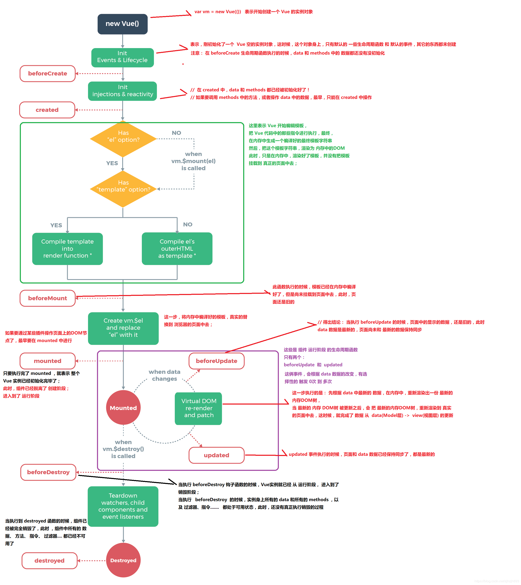

## Vue  

### 组件生命周期

```js
new Vue({
    beforeCreate() {
        // 在事件&生命周期初始化后调用
    },
    created() {
        // 在数据劫持后调用
    },
    beforeMount() {
        // 模版编译完成后调用
    },
    mounted() {
        // 挂载后调用
    },
    beforeUpdate() {
        // 更新前调用
    },
    updated() {
        // 重新渲染后调用
    },
    beforeDestroy() {
        // 销毁组件观察者、子组件、事件监听前调用
    },
    destroyed() {
        // 销毁组件后调用
    },
    activited() {
        // keep-alive 专属，组件被激活时调用
    },
    deactivated() {
        // keep-alive 专属，组件被销毁时调用
    }
})
```



### 指令

- `v-if`, `v-else-if`, `v-else`
- `v-show`
- `v-for`
- `v-on`
- `v-bind`
- `v-model`

### `v-model`

`v-model` 是 Vue 双向数据绑定的核心指令，能够将表单元素和数据字段进行绑定，其内部原理通过监听表单元素的改变事件和自动修改表单元素的值。

```js
$input.addEventListener('input', e => {
    vm.data.value = e.target.value
})

vm.$watch('value', newVal => {
    $input.value = newVal
})
```

### 组件通信

1) 父子组件通信

父组件通过**子组件的属性**传递数据，子组件调用 `$emit` 调用父组件函数。

2) 通过 `ref`, `$parent`, `$children`

`ref`： 在普通DOM元素上使用时指向DOM实例，在组件上使用时指向组件实例。

`$parent,$children`: 访问父/子组件实例。

3) `EventBus` 

通过实例化一个空的 Vue 实例，并通过其 `$on/$emit` 来实现父子组件，兄弟组件，隔代组件的通信。

4) `$attrs/$listeners`

适用于隔代组件的通信，通过声明 `v-bind="$attrs"` 可以使得后代组件使用祖先组件的数据。

```vue
<template>
<div id="app">
    <son :msg="msg" @changeMsg="handleChangeMsg"></son>
</div>
<template>
<script>
import Son from 'son'
export default {
  data() {
    return {
      msg: 'Hello Vue'
    }
  },
  components: {
    Son
  },
  methods: {
    handleChangeMsg(val) {
        this.msg = val
    }
  }
}
</script>
```

```vue
<template>
<g-son :msg="msg" v-bind="$attrs" v-on="$listeners"></g-son>
<template>
<script>
// son.vue
import GSon from 'gson'
export default {
  components: {
    GSon
  }
}
</script>
```

```vue
<template>
<div>
  <p>{{msg}}}</p>
  <button @click="handleChange">Change</button>
</div>
<template>
<script>
// gson.vue
export default {
  props: ['msg'],
  methods: {
    handleChange() {
        this.$emit('changeMsg', 'Hello World')
    }
  }
}
</script>
```

5) `provide/inject`

适用于隔代组件通信，祖先组件通过 `provide` 提供数据，后代组件通过 `inject` 注入变量获取数据。

```vue
<template>
<div>
  <p>{{msg}}</p>
  <comp/>
</div>
</template>

<script>
import Comp from 'comp'
export default {
  components: {
    Comp
  },
  data () {
    return {
        msg: 'hello'
    }
  },
  provide () {
    return {
      changeMsg: this.changeMsg
    }
  },
  methods: {
    changeMsg(newVal) {
      this.msg = newVal
    }
  }
}
</script>
```

```vue
<template>
<button @click="handleChange">change</button>
</template>
<script>
// comp.vue
export default {
  inject: ['changeMsg'],
  methods: {
    handleChange() {
        this.changeMsg('hi')
    }
  }
}
</script>
```

6) Vuex

使用状态管理工具 Vuex 可以实现父子、隔代、兄弟组件间的通信。

- Vuex 的状态存储是响应式的。当组件从 `store` 中读取状态的时候，若 `store` 中的状态发生变化，那么相应的组件也会更新。
- 改变 `store` 的唯一途径是显式触发 `mutation`，这使得我们可以很方便的更总每一个状态的变化。

