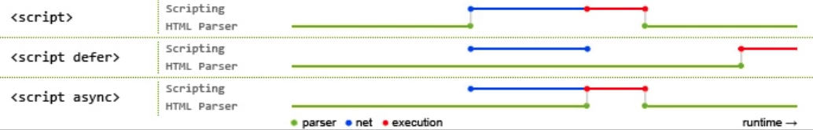

## HTML基础

### DOCTYPE 的作用

DOCTYPE处于文档的最前面，用于告诉浏览器以什么文档解析标准来解析文档，不同的渲染模式甚至会影响到浏览器对CSS代码和JavaScript代码的解析。

文档解析类型有：

- 怪异模式（BackCompat）：浏览器使用自身的怪异模式解析渲染页面（如果没有设置DOCTYPE，则默认就是此模式）。以兼容更久浏览器的行为来解析渲染页面。
- 标准模式（CSS1Compat）：浏览器使用W3C标准解析HTML和CSS代码渲染页面。
- 近乎标准：介于怪异模式和标准模式之间。

### 常用标签

#### div

作用：定义一个块；

```html
<div>这是一个块</div>
```

#### h1-h6

作用：定义重要的头部信息；

```html
<h1>This is Heading 1</h1>
<h2>This is Heading 2</h2>
<h3>This is Heading 3</h3>
<h4>This is Heading 4</h4>
<h5>This is Heading 5</h5>
<h6>This is Heading 6</h6>
```


#### img

作用：定义图片；

```html

```

#### a

作用：定义链接；

```html
<a href="google.com">跳转到Google</a>
```

#### p

作用：定义段落；

```html
<p>这是一个段落。</p>
```

#### form 相关元素

作用：定义表单；

```html
<form action="" method="">
    <input type="text" name="">
    <input type="password" name="">
    <input type="radio">
    <input type="checkbox" name="">
    <textarea name="" id="" cols="30" rows="10"></textarea>
    <select>
        <option></option>
    </select>
</form>
```

#### 更多元素

更多元素在 [语意化篇](语意化.md)中介绍。


### 常用通用属性

- id：指定元素的唯一标识。
- class：指定元素所属类别。
- style：以内联方式设定元素样式
- title：显示元素省略的内容；当光标移动到元素上时显示title中的内容

### 元标签

`<meta>` 元素代表了不能无法用其他元素表示的元数据。

拥有如下属性：

- charset
- name
- content
- http-equiv

#### charset 

此属性用于声明文档所使用的字符编码。不过此声明可以被任何一个元素的 `lang` 属性覆盖。通常将其设置为 `UTF-8`。

```html
<meta charset="utf-8">
```

#### content

此属性包含 `http-equiv` 或 `name` 的值，具体取决于所使用的值。

#### name

此属性用于定义文档级别的元数据的名称。可设置为如下值：

```html
<!-- 定义应用的名车个 -->
<meta name="application-name" content="My App">
<!-- 定义网页的作者 -->
<meta name="author" content="jack">
<!-- 定义网页的描述信息 -->
<meta name="description" content="this is page description">
<!-- 定义网页的关键字 -->
<meta name="keywords" content="keyword1,keyword2,keyword3">
<!-- 控制所有从当前文档发出的HTTP请求头中 Referrer 内容 -->
<meta name="referrer" content="no-referrer">
<!-- 提供有关视口初始大小的提示，仅供移动设备使用 -->
<meta name="viewport" content="width=device-width,initial-scale=1.0,user-scalable=no,viewport-fit=cover">
```

#### http-equiv

此属性定义了能改变响应头的相关字段，相当于http响应头的作用：

```html
<!-- 内容安全策略 -->
<meta http-equiv="conten-security-policy" content="">
<!-- 定义刷新时机 -->
<meta http-equiv="refresh" content="">
```


### 重点

#### src和href的区别

两个属性都用于指定资源的位置，src属性用于 `script`, `img`, `iframe` 等元素，指向的资源会嵌入到当前标签所在的位置，在请求资源时会将其下载并应用到文档内。若是请求script标签，会暂停当前文档的解析而去下载并解析脚本。

href属性指向网络资源所在位置作为超链接，用作建立文档与文档之间的连接。当浏览器识别到此属性时，会并行下载资源，不会停止对当前文档的解析。

#### data-属性

`data-` 可用于为元素自定义的属性，自定义的属性可以通过DOM的 `dataset` 属性读取：

```html
<div data-name="jack" data-age="22">自定义属性</div>
<script type="text/javascript">
    const $div = document.querySelector('div')
    console.log($div.dataset['name']) // jack
    console.log($div.dataset['age']) // 22
</script>
```

#### srcset属性的作用

`srcset` 是 `img` 标签的属性，提供了根据屏幕条件选取图片的能力。通过和 `sizes` 属性来为 `img` 提供更多额外的图像资源，帮助浏览器选择适合的资源。

`srcset` 定义了允许浏览器选择的图像集，以及每个图像的大小。

`sizes` 定义了一组媒体条件，指明当条件为真时，应当选择什么尺寸的图像资源。

流程如下：
1. 查看设备宽度
2. 检测sizes列表中那个媒体条件第一个为真
3. 查看给予该媒体查询的槽大小
4. 加载srcset列表中最接近槽大小的图像

```html

```

另外 `picture` 标签也能起到相似的作用。

```html
<picture>
    <source src="dog-200.jpg" media="(max-width: 800px)">
    <source src="dog-400.jpg" media="(min-width: 800px)">
    
</picture>
```

#### script标签中defer和async的区别

`defer` 和 `async` 属性都用于指示异步加载 `script` 资源。

`defer`: 指示脚本在文档被解析完成后执行，脚本异步加载后并不会立即执行，而是等待文档被解析完成后执行。并且按照HTML5规范，脚本应当按照他们出现的先后顺序执行。

`async`: 脚本在异步加载后会立即执行，导致async属性下的脚本是乱序的，对于script有先后依赖关系的情况下，并不适用。

